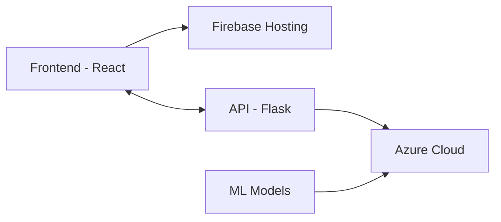

# 🚀 MLflow.ai - Intelligent Machine Learning Pipeline Platform

<div align="center">

  [](https://www.typescriptlang.org/)
  [](https://reactjs.org/)
  [](https://vitejs.dev/)
  [](https://tailwindcss.com/)
  [](https://flask.palletsprojects.com/)
  [](https://firebase.google.com/)
  [](https://azure.microsoft.com/)

  <p align="center">
    <strong>🌟 Production-grade ML Pipeline Platform | Built with Modern Tech Stack 🌟</strong>
  </p>
</div>

## 🎯 About MLflow.ai

MLflow.ai is a cutting-edge machine learning pipeline platform that revolutionizes the way data scientists and ML engineers work. It provides an intuitive, end-to-end solution for data preprocessing, model training, and evaluation, all wrapped in a beautiful, modern interface.

## 🏗️ Architecture



## 💻 Tech Stack

### Frontend
- **Framework**: React 18.3 with TypeScript
- **Build Tool**: Vite
- **Styling**: TailwindCSS
- **UI Components**: Radix UI
- **Charts**: Recharts
- **Code Highlighting**: Prism.js
- **State Management**: React Hooks
- **Deployment**: Firebase Hosting

### Backend
- **API Framework**: Flask (Python)
- **Cloud Platform**: Azure
- **Database**: Azure SQL
- **ML Libraries**: 
  - NumPy
  - Pandas
  - Scikit-learn
  - TensorFlow

### DevOps
- **Frontend Hosting**: Firebase
- **Backend Hosting**: Azure App Service
- **CI/CD**: GitHub Actions
- **Monitoring**: Azure Monitor

## 🔌 API Architecture

### 📊 Data Management
```http
POST /api/load          # Load dataset
GET  /api/head?n=5     # Get first n rows
GET  /api/describe     # Statistical description
GET  /api/missing      # Missing values analysis
```

### ⚙️ Preprocessing
```http
POST /api/preprocess/encode      # Encode categorical variables
POST /api/preprocess/scale       # Scale features
POST /api/preprocess/split       # Split dataset
```

### 🤖 Model Operations
```http
POST /api/model/init      # Initialize model
POST /api/model/train     # Train model
POST /api/model/evaluate  # Evaluate model
POST /api/model/predict   # Make predictions
```

## ✨ Key Features

- 🎨 **Beautiful UI/UX**
  - Responsive design
  - Dark/Light mode
  - Interactive visualizations

- 🔄 **Real-time Processing**
  - Live data preprocessing
  - Real-time model training status
  - Interactive data exploration

- 🤖 **Advanced ML Capabilities**
  - Multiple algorithm support
  - Automated feature engineering
  - Model performance comparison

- 📊 **Comprehensive Analytics**
  - Interactive dashboards
  - Custom visualization options
  - Detailed model metrics

## 🚀 Quick Start

```bash
# Clone repository
git clone https://github.com/yourusername/mlflow-ai.git

# Install dependencies
npm install

# Start development server
npm run dev

# Build for production
npm run build
```

## 📂 Project Structure

```
mlflow-ai/
├── src/
│   ├── api/           # API integration
│   ├── components/    # React components
│   ├── hooks/         # Custom React hooks
│   ├── config/        # Configuration
│   └── utils/         # Utility functions
├── public/            # Static assets
└── backend/          # Flask API
    ├── api/          # API routes
    ├── models/       # ML models
    └── utils/        # Backend utilities
```

## 🔐 Environment Setup

```env
# Frontend (.env)
VITE_GROQ_API_KEY=your_key
VITE_API_URL=your_api_url

# Backend (.env)
AZURE_CONNECTION_STRING=your_connection
FLASK_ENV=development
```

## 🤝 Contributing

We welcome contributions! Please see our [Contributing Guide](CONTRIBUTING.md) for details.

## 📝 License

This project is licensed under the MIT License - see the [LICENSE](LICENSE) file for details.

---

<div align="center">
  <p>Built with ❤️ by <a href="https://github.com/yourusername">Rohit Kumar</a></p>
</div>